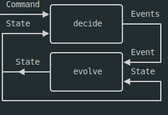

# Event Sourcing Types Only

An Event Sourcing system based only on Typescript types.  
Inspired by this [Functional Event Sourcing Decider](https://thinkbeforecoding.com/post/2021/12/17/functional-event-sourcing-decider) blog post.

_Event Sourcing TLDR: don't store the final state of an object, store the command/events that led to that state._

## Architecture

The Event Sourcing system is designed to follow the following steps at each clock:

- receive an input
- process the received input through a decider
- the decider produces a list of events
- each event is processed by a fold function to produce a new state
- once all events are folded, the final state is returned

A clock is triggered by command reception.

_Note: in the blog post proposal, this is a pure functional core system._
_The application layer is responsible for:_

- _translating external commands/events into internal commands_
- _observing output events and triggering the associated side effects_

## Usage

- Press `.` or change the domain from `github.com` to `github.dev` (maintaining the URL) to open the editor.  
- Open /src/index.ts 
- Let few minutes for the Typescript engine to steam up in the browser.
- Hover with the mouse on the example types to observe how the system works.

## Disclaimer

This is a proof of concept, not a fully polished library.  
It is just here to demonstrate how Typescript can be used to model an Event Sourcing system using types only.